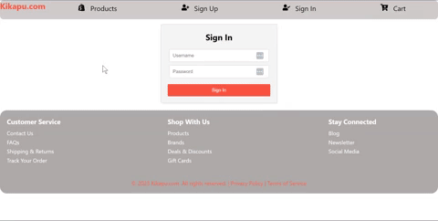
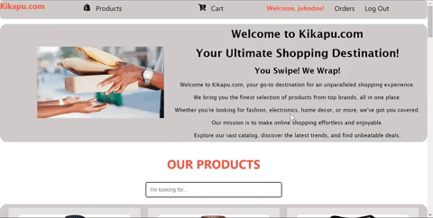
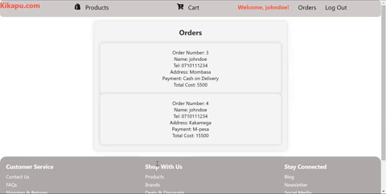

## Project Description

Kikapu.com is an e-commerce website that allows users to view products, without signing into the page,
sign up as a user, add items to the cart and checkout.
After checking out, it is possible to see all the pending orders of the user.

The link to my frontend on Vercel: 

https://phase-2-project-umber.vercel.app/

the link to my orders server on Render:

https://kikapu-server-iwt5.onrender.com/

My backend APIs:

BASE_URL= http://ecommerce.muersolutions.com/Links to an external site.api/v1

Docs_base_url = http://ecommerce.muersolutions.com/developer/redocLinks to an external site.

Fetch Products => http://ecommerce.muersolutions.com/api/v1/products

The sign-in and sign-up functionality is handled using the local storage.
This is due to an error with the sign-up and sign-in API provided for the project.

## Project Setup

To get started, follow these steps to set up your project:

1. Fork and clone the repository.

   `git clone git@github.com:tomutanyi/phase-2-project.git`

2. install npm and use npm start to start the app.

Use these commands:

   `npm install`

3. Run npm start to start the React app:

   `npm start`

4. Use this command to stop the React app:

   `CTRL + C`

## Project Features

1. A page displaying all the products

2. A page to sign up as a user.

3. A page to sign in and have the username displayed at the top of the page.

4. Clicking on a product displays it's details.

5. A searchbar to search products regardless of case.

6. A cart to add items.

7. A checkout form to checkout items to buy once in the cart.

8. An orders page that the user is automatically navigated to
   after checkout & displays a user's current orders.

8. A button to log out.

### Bonus Deliverable

1. An orders page to track orders

## Technologies used

1. React for the frontend.
2. CSS and React icons for the styling.
3. Node.js for running the react app.
4. Vercel for front-end hosting.
5. Render for back-end hosting of the orders database.
6. React-icons for the dasboard.

## Authors

1. Tom Omele Mutanyi
2. Mercy Muriithi
3. Victor Masibo
4. Victor Wanjala
5. William Nyongesa

## License

Licensed under the [MIT license](LICENSE)
