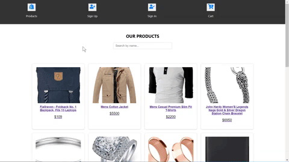
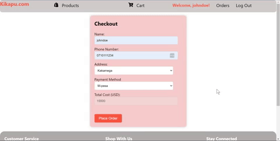

## Project Description

This is an E-commerce site that allows users to select items, add the items to their cart and perform a checkout.

The link to my frontend on vercel: 

https://phase-2-project-umber.vercel.app/

My backend APIs:

BASE_URL= http://ecommerce.muersolutions.com/Links to an external site.api/v1

Docs_base_url = http://ecommerce.muersolutions.com/developer/redocLinks to an external site.

 

ENDPOINTS

SIGN UP => http://ecommerce.muersolutions.com/api/v1/user/signupLinks to an external site.

SIGN IN => http://ecommerce.muersolutions.com/api/v1/user/loginLinks to an external site.

 

Fetch Products => http://ecommerce.muersolutions.com/api/v1/products

## Project Setup

To get started, follow these steps to set up your project:

1. Fork and clone the repository.

`git clone git@github.com:tomutanyi/phase-2-project.git`

2. install npm and use npm start to start the app.

Use this commands:

`npm install`

Run npm start to start the React app:

`npm start`

Use this command to stop the React app:

`CTRL + C`

## Project Features

1. A page displaying all the products

2. A page to sign up as a user.

3. A page to sign in and have the username displayed at the top of the page.

4. Clicking on a product displays it's details.

5. A searchbar to search products regardless of case.

6. A cart to add items.

7. A checkout form to checkout items to buy once in the cart.

8. An orders page that the user is automatically navigated to
   after checkout & displays a user's current orders.

## Technologies used

1. React for the frontend.
2. CSS and React icons for the styling.
3. Node.js for running the react app.
4. Vercel for front-end hosting.
5. Render for back-end hosting of the orders database.

## Authors

1. Tom Omele Mutanyi
2. Mercy Muriithi
3. Victor Masibo
4. Victor Wanjala
5. William Nyongesa

## License

Licensed under the [MIT license](LICENSE)
